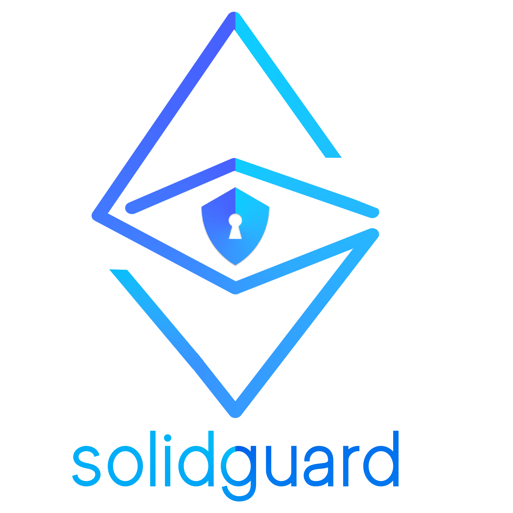

<div align="center">
  <p align="center">
    
  </p>
<h1>Server Setup for solidguard-backend</h1>
</div>

**Version:** `prototype-v1.0`

## Table of Contents
* [1. Install dependencies](#1-install-dependencies)
* [2. Environment Variables Setup](#2-environment-variables-setup)
* [3. Smart Contract Setup](#3-smart-contract-setup)
* [4. Prisma Setup](#4-prisma-setup)
* [5. Starting the NestJS Server](#5-start-nestjs-server)

## Setup

### 1. Install Dependencies

Install the dependencies for the Nest application:

```bash
npm install
```

After all dependencies have been installed, it will automatically run `npm run prisma:generate`, which will generate all the entity types used in the server.

### 2. Environment Variables Setup
Fill in the following environment variables in a new file called `.env`:
#### Prisma + PostgreSQL
* `DATABASE_URL` The database connection URL to the PostgreSQL database.

#### Redis
* `REDIS_HOST` Host for the redis database.
* `REDIS_PORT` Port for the redis database.

#### Nest.js
* `PORT` Port of the Nest.js server.

#### Smart Contracts
* `PROVIDER_URL` Provider URL for EVM-compatible blockchains. You can get a provider URL via [Infura](https://infura.io/).
* `DEPLOY_PRIVATE_KEY` Private key used for deployment of smart contracts and tests that uses third-party APIs. You can generate one via [vanity.eth](https://vanity-eth.tk/). It is important that the account associated with this private key is owner of the SolidGuardManager at the address `SGM_ADDRESS`.
* `ETHERSCAN_API_KEY` [Etherscan](https://etherscan.io/) API Key. Can be generated by signing up on their website.
* `ETHERSCAN_URL` Base URL used to fetch information from Etherscan. This needs to correspond to the same blockchain provided in `PROVIDER_URL`.
* `SGM_ADDRESS` SolidGuardManager Smart Contract address on any of the EVM-Compatible blockchains. It should correspond to the same blockchain provided in `PROVIDER_URL`, and will be filled in during the smart contract setup.

#### Security
* `JWT_ACCESS_SECRET` [Passport-jwt](http://www.passportjs.org/packages/passport-jwt/) A string containing the secret for verifying the JSON web token's signature.
* `JWT_EXPIRES_TIME`  A string describing a time span as the expire time of a JSON web token, defined for JwtModule.

#### Emails
* `TRANS_HOST` The host name for the email notification service. Should be "smtp.ethereal.email" by default
* `TRANS_PORT` The port number for email notification service. Should be 587 by default.
* `EMAIL_USER` The user name account for SolidGuard service. e.g. solidguard@gmail.com. It can be undefined if using a temporary test account.
* `EMAIL_PASSWORD` The actual password for the above email account. It can be undefined if using a temporary test account.
* `EMAIL_SERVICE` The service that used for the email account. e.g. 'gmail', 'hotmail'. It can be undefined if using a temporary test account.

#### Initial Admin Account
* `ADMIN_EMAIL` The email of the admin account created on server startup.
* `ADMIN_PASSWORD` The password of the admin account created on server startup.

Examples of these variables can be seen in [`.env.example`](../.env.example).


### 3. Smart Contract Setup

First, you will need to run 
```bash
npx hardhat run --network providerNetwork deploy/solid-guard-manager.deploy.ts
```
to deploy a new SolidGuardManager under the ownership of the deployer account.

You will see an address appear in the console. Copy it and save it in the `.env` file as `SGM_ADDRESS`.

Next, you will need to verify the smart contract on etherscan by doing 
```bash
npx hardhat verify --network providerNetwork SGM_ADDRESS
```
with `SGM_ADDRESS` being the addressed printed from earlier.

If you want to deploy other smart contracts to test the pauseability, see [dapp-setup.md](dapp-setup.md) on how to do this.


### 4. Prisma Setup

To setup Prisma, you will need to run 

```bash
npm run migrate:dev
```

to migrate the schemas used in the PostgreSQL database.

### 5. Start NestJS Server

Run Nest Server in Development mode:

```bash
npm start

# watch mode
npm run start:dev
```
Now your server should be up! For instructions on using the APIs, see `/api/` for the Swagger documentation.

[Back to top](#table-of-contents)
